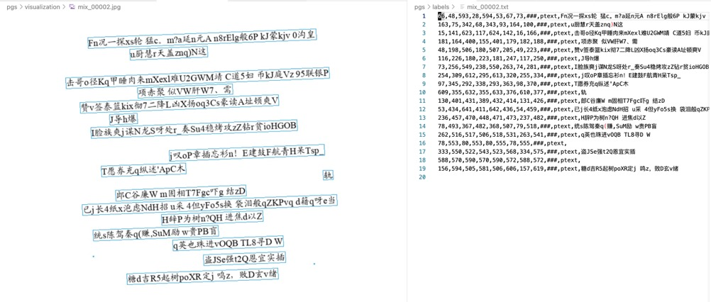
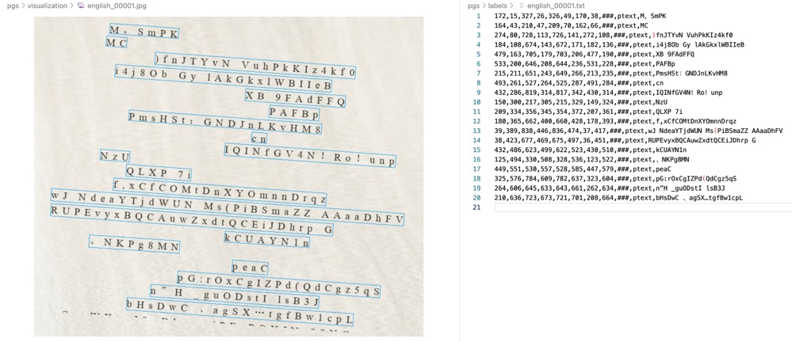
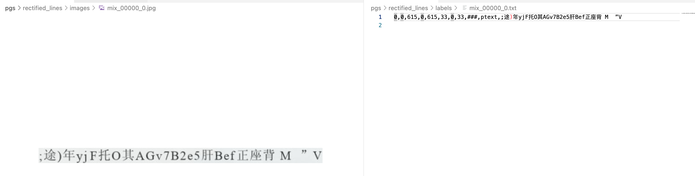
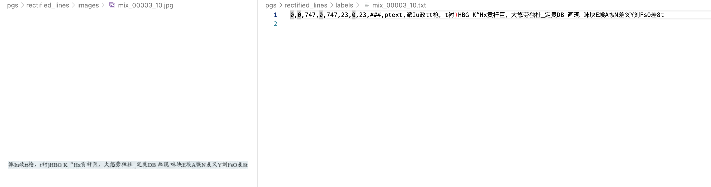

# ocr-sample-generator

OCR样本生成器，可自动生成用于训练OCR检测和识别模型的图片样本和标注。

- 精简方便的配置模式，快速自定义需要的样本规格
- 支持随机生成文本行，包括全图文本和单行文本，同时生成精确的四点框坐标和文本内容
- 支持自定义增广
- 支持生成样本可视化
- 支持不同字体
- 支持自定义文本布局和文本类型


<div align="center">
  
  
  
  
</div>


## 立即使用

先安装依赖

```pip install -r requirements.txt```

然后执行

```python main.py configs/xxx.py dst_dir num_samples```

其中，`xxx.py`表示配置文件，`dst_dir`表示生成样本的保存目录，样本图片文件保存在`dst_dir/global_canvas/images`，标注文件保存在`dst_dir/global_canvas/labels`，可视化图像保存在`dst_dir/global_canvas/visualization`

例如

```python main.py configs/english.py pgs 20```

将按照配置文件`english.py`的规格生成20个样本，保存在`pgs`文件夹中。

## 配置文件说明
```
BASE_NAME= "mix" # 合成图像的前缀名称

fs = (15, 30)
LAYOUT = dict( # 生成图像的布局配置
    IMAGE_WIDTH= (600, 1000), # 图像的宽度范围，()表示从连续区间中取值，长度超出图像宽度的文本行会被忽略
    IMAGE_HEIGHT= (200, 1000), # 图像的高度范围，文本行从上到下对高度进行填充，填满为止
    FONT_SIZE= fs,
    CHAR_SPACING = [0, 0, 0, 0, 0, 0, 1, 2, 5, 10], # 字符间距，[]表示从集合中随机抽取一个
    LINE_SPACING = (int(1 / 5 * fs[0]), int(15 / 25 * fs[0])), # 行间距
)

CONTEXT = dict( # 生成图像的文本内容比例配置
    HANZI_PROPORTION = (0.2, 0.5), # 汉字比例
    LETTER_PROPORTION = (0.2, 0.5), # 英文字母比例
    NUMBER_PROPORTION = (0, 0.1), # 数字比例
    PUNCTUATION_PROPORTION = (0, 0.1), # 标点符号比例
    SPACE_PROPORTION = (0, 0.1), # 空格比例
)
SAVE_RECTIFIED_LINES_SEPARATELY = True # 是否逐行保存，即根据生成的样本把每个文本行裁出来拉正保存（通常用于训练识别模型），使能后会在保存目录下新建一个rectified_lines文件夹保存每张图上的每个文本行
```

## 欢迎issue和pr